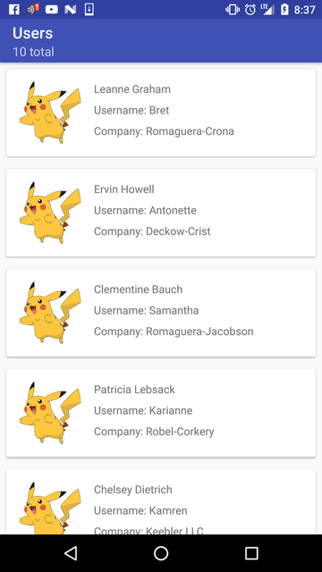
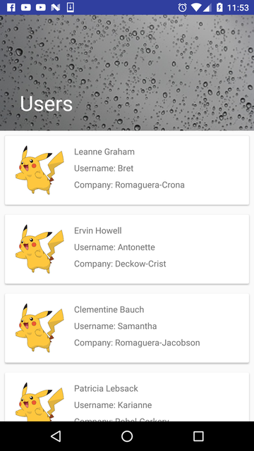
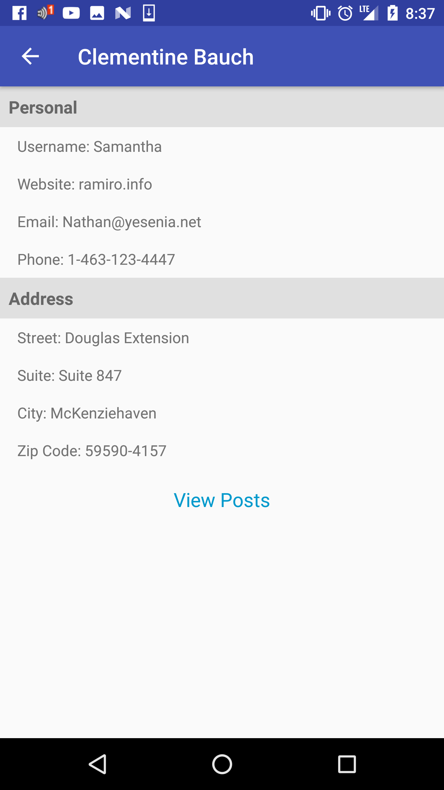
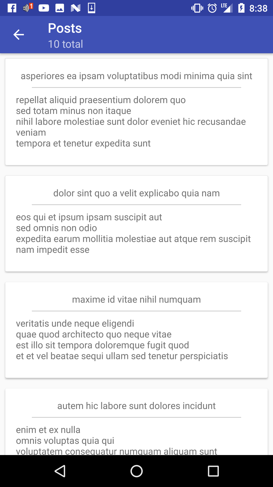

# AndroidUserExample
A quick and easy android app that fetches and displays data from an open api: https://jsonplaceholder.typicode.com/ Some of the libraries used include:

+ Butterknife http://jakewharton.github.io/butterknife/
+ Retrofit https://square.github.io/retrofit/
+ Picasso http://square.github.io/picasso/
+ Parceler (Because setting up parcelables yourself is just plain tedius) https://github.com/johncarl81/parceler

Things other things to be done in the near future include:
+ Set up my own Json server, so I edit the data to my liking
+ Testing, Testing, Testing (primarily Junit and Espresso)
+ Some useful animations
+ Adding some color to the app

