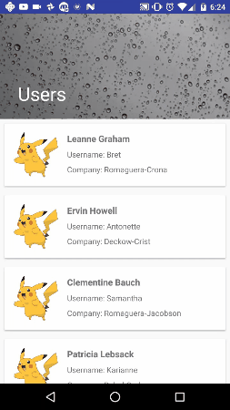

A quick and easy android app that fetches and displays data from an open api: https://jsonplaceholder.typicode.com/ Some of the libraries used include:

+ Butterknife http://jakewharton.github.io/butterknife/
+ Eventbus https://github.com/greenrobot/EventBus
+ Retrofit https://square.github.io/retrofit/
+ Picasso http://square.github.io/picasso/
+ Parceler https://github.com/johncarl81/parceler
+ Dagger 2 https://github.com/google/dagger

Things other things to be done in the near future include:
+ Set up my own Json server, so I edit the data to my liking
+ Testing, Testing, Testing (primarily Junit and Espresso)
+ Some useful animations
+ Adding some color to the app

All original code. Feel free to fork, clone, contribute, etc

